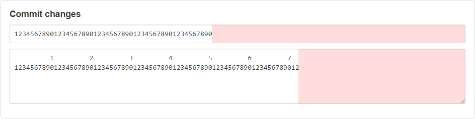

# GitHub Commit Limit

See http://tbaggery.com/2008/04/19/a-note-about-git-commit-messages.html
Here are some issues with making a change to a file online at GitHub:
* To commit a change, you'll get a input for the commit title and a textarea for any additional details.
* There is an alert that pops up when you go past 50 characters in the title, but shows nothing in the textarea.
* These elements do not use a monospace font, nor do they show any indication as to where you should add a line break to maintain formatting
This style was inspired by [this thread](https://github.com/torvalds/linux/pull/17) :heart: Linus

## Preview

## Install

A userstyle extension is required, common ones include:

🎨 Stylus for [Firefox](https://addons.mozilla.org/en-US/firefox/addon/styl-us/), [Chrome](https://chrome.google.com/webstore/detail/stylus/clngdbkpkpeebahjckkjfobafhncgmne) or [Opera](https://addons.opera.com/en-gb/extensions/details/stylus/). 
🎨 xStyle for [Firefox](https://addons.mozilla.org/firefox/addon/xstyle/) or [Chrome](https://chrome.google.com/webstore/detail/xstyle/hncgkmhphmncjohllpoleelnibpmccpj).

Then:

📦 [Install the usercss](https://raw.githubusercontent.com/StylishThemes/GitHub-Commit-Limit/master/github-commit-limit.user.css). Supports automatic updates. 
📦 [Install from userstyles.org](https://userstyles.org/styles/130386). Does not support automatic updates & is NO LONGER UPDATED.

## Contributions

If you would like to contribute to this repository, please...

1. 👓 Read the [contribution guidelines](CONTRIBUTING.md).
2.  [fork](https://github.com/StylishThemes/GitHub-Commit-Limit/fork) or 
[Download](https://github.com/StylishThemes/GitHub-Commit-Limit/archive/master.zip),
3. 👌 Create a pull request!

Thanks to all that have [contributed](AUTHORS) so far!
